# Тестування працездатності системи

Тестування системи було виконано через надсилання запитів за допомогою програми Postman та перевірки отриманих відповідей.
## Запуск сервера
 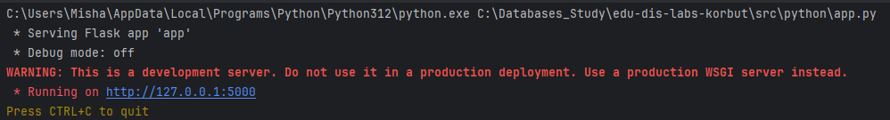

## Метод GET

### Отримання усіх посилань
#### Запит
 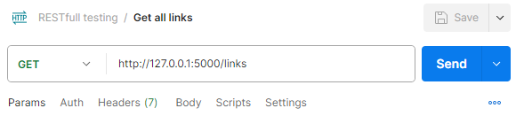
#### Відповідь
 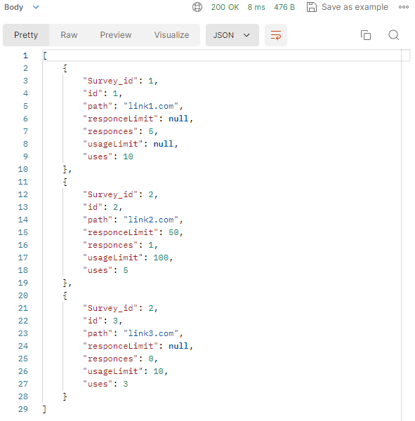

### Отримання посилань по id
#### Запит
 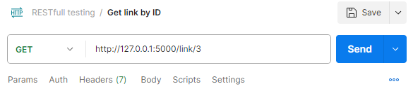
#### Відповідь
 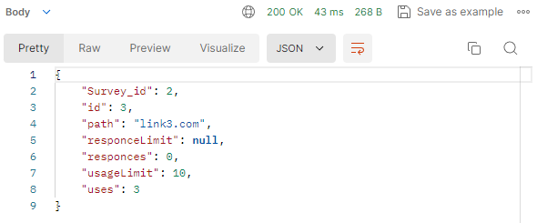

## Метод POST

### Створення посилання
#### Запит
 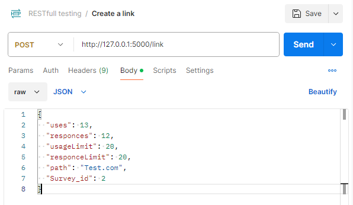
#### Відповідь
 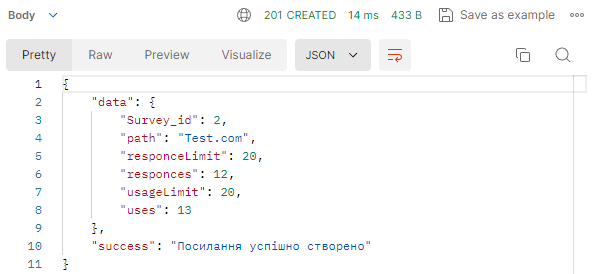

#### Перевірка за допомогою GET
 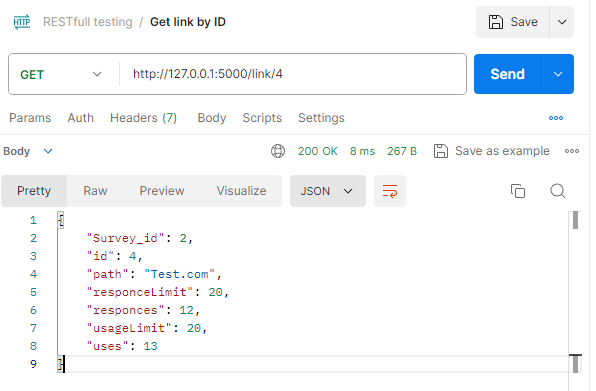

## Метод PUT

### Зміна посилання
#### Запит
 
#### Відповідь
 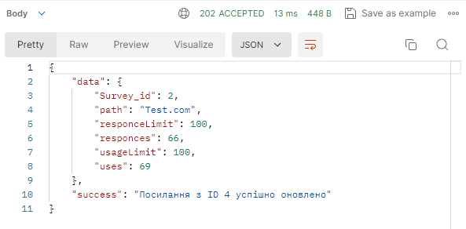

#### Перевірка за допомогою GET
 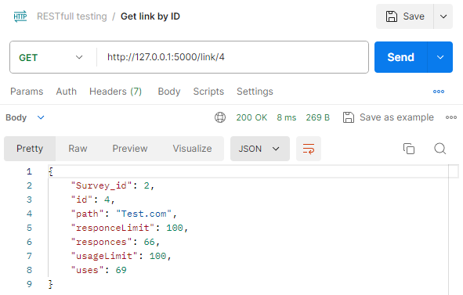
 
## Метод DELETE

### Видалення посилання
#### Запит
 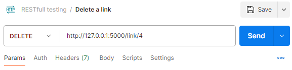
#### Відповідь
 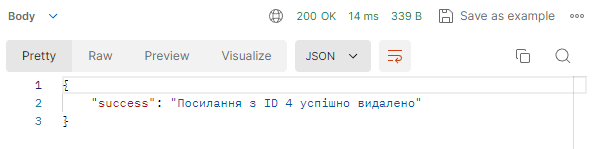

#### Перевірка за допомогою GET
 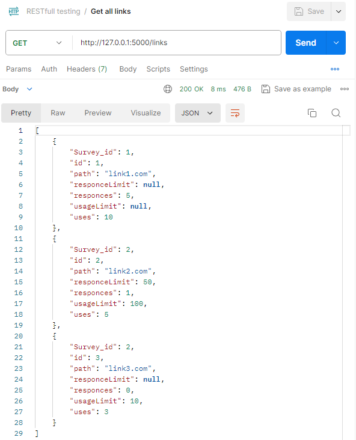

## Крайні випадки
### Створення з некоректними параметрами
#### Запит
 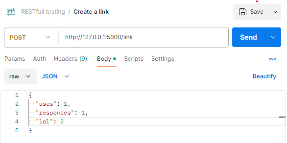
#### Відповідь
 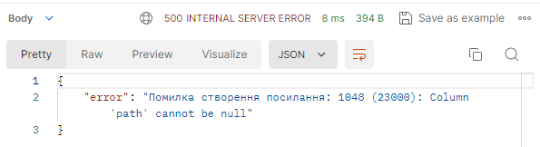

### Видалення посилання, що не існує
#### Запит
 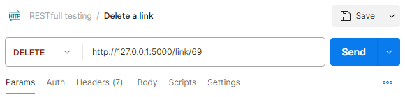
#### Відповідь
 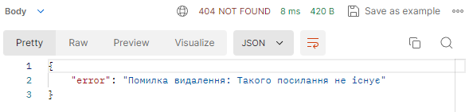
 
Як можна помітити, сервіс працює корректно.